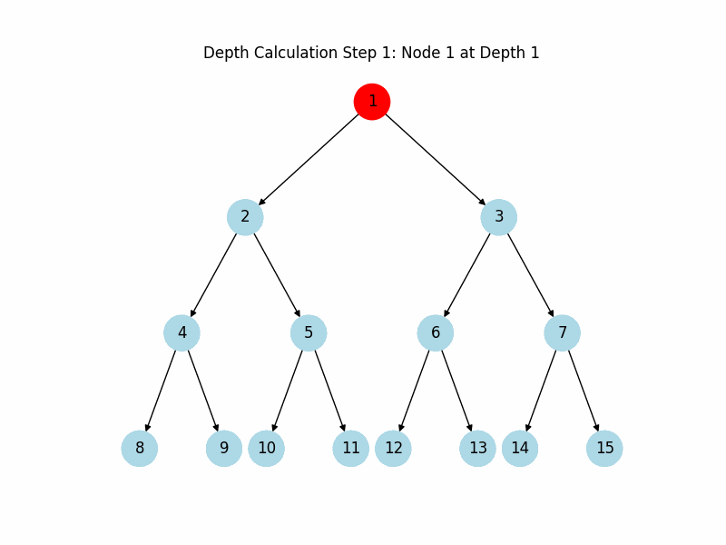

# **🌳 Binary Trees: Problems with Visuals 🌳**
<p align="left">
  
  
  
</p>

Welcome to the **Binary Trees** folder! This repository is a collection of coding problems related to binary trees, from fundamental operations to advanced concepts. Each problem includes explanations, code solutions, and visual animations where applicable to illustrate the binary tree's behavior and functionality.

---

## 📚 Table of Contents

- [Overview](#overview)
- [Problem List](#problem-list)
- [File Structure](#file-structure)
- [How to Use](#how-to-use)
- [Examples](#examples)
- [Contributing](#contributing)
- [License](#license)

---

## 📖 Overview

Binary trees are foundational data structures in computer science, essential to algorithms and applications. This folder is dedicated to exploring various aspects of binary trees through coding problems and solution walkthroughs. Problems range from calculating tree height, traversals, and node insertion to more advanced tasks like balancing trees and performing transformations.

Each problem is organized to help users:
- **Understand** the problem statement.
- **Follow** the code solution step-by-step.
- **Visualize** the process with GIF animations (where applicable).

---

## 📝 Problem List

| Problem                       | Description                                      | Solution Link                         |
|-------------------------------|--------------------------------------------------|---------------------------------------|
| Maximum Depth or Height       | Calculate the height of a binary tree.           | [View Solution](max_depth.py)  |
| Binary Tree Traversals        | Perform pre-order, in-order, and post-order traversal. | [View Solution](traversals/traversals.py) |
| Node Insertion                | Insert a node in a binary tree.                  | [View Solution](insert_node/insert.py) |
| Binary Tree Level Order       | Traverse binary tree level-by-level.             | [View Solution](level_order/level_order.py) |
| Balanced Binary Tree Check    | Check if a binary tree is height-balanced.       | [View Solution](balanced_tree/balanced_tree.py) |

This list will grow as more problems are added to the collection. 

---

Each problem is stored in a dedicated subfolder, which contains:
>1. The Python script for the solution.
>2. An optional GIF animation demonstrating the solution visually.

---

## 🚀 How to Use

1. **Clone the repository**:
   ```bash
   git clone https://github.com/arnabsaha7/dsa.git
   cd dsa/Trees/Binary_Trees
   ```

2. **Run a problem solution**:
   Open any problem's `.py` file to view the solution. You can run it directly:
   ```bash
   python max_depth/height.py
   ```

3. **View GIF animations**:
   For problems with visualizations, navigate to the `img/` directory or the specific problem folder to view the GIF.

---

## 🖼️ Examples

### GIF Visualizations

|             |             |             |
|-------------|-------------|-------------|
|  |  |  |
| **Maximum Depth of a Binary Tree** | **TBA** | **TBA** |
| Add new GIFs here | Add new GIFs here | Add new GIFs here |

For more examples and solutions, see each respective problem folder.

---

## 🤝 Contributing

Contributions are welcome! To contribute:
1. Fork the repository.
2. Create a new branch for your feature or problem.
3. Add your solution in a new folder, following the existing structure.
4. Submit a pull request with a clear description.

