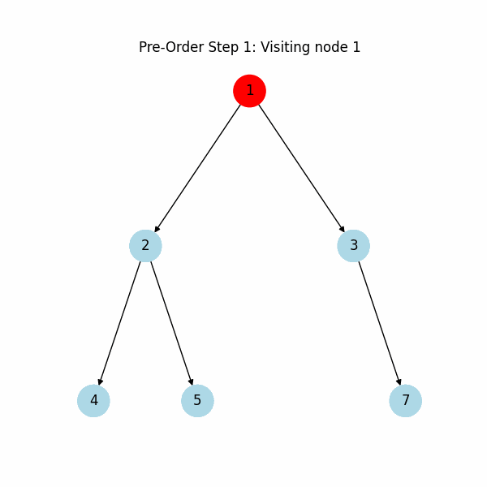
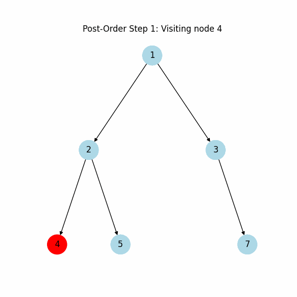
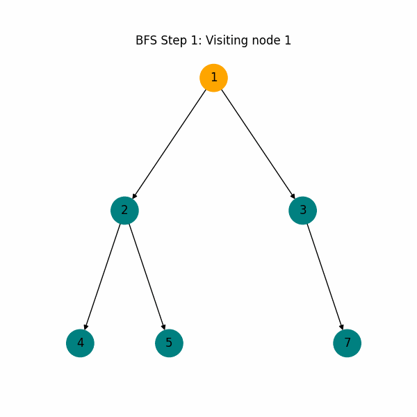

# 🌳 **Data Structures and Algorithms: Tree**

Explore a comprehensive collection of **Tree Data Structures** topics, including different types of trees, traversal techniques, properties, and advanced operations. Perfect for anyone diving into trees for **data structures, algorithms, or interview prep**!

---

## 📂 Folder Structure

```plaintext
Trees/
├── Binary Trees
├── Binary Search Trees (BST)
├── AVL Trees
├── Red-Black Trees
├── Trie (Prefix Tree)
├── Segment Trees
├── Fenwick Trees (BIT)
├── Heaps
└── Traversals
```

---

## 🚀 Key Topics

| Topic | Description | Icon |
|-------|-------------|------|
| **Basic Concepts**       | Core definitions and tree terminology       | 🌱 |
| **Tree Types**           | Learn about different types of trees        | 🌳 |
| **Traversal Techniques** | In-Order, Pre-Order, Post-Order, Level-Order Traversals | 🔄 |
| **Advanced Traversals**  | Morris, Zigzag, Boundary, and Diagonal Traversals | 🚀 |
| **Tree Properties**      | Height, depth, balanced trees, etc.         | 📏 |
| **Tree Manipulation**    | Insert, delete, rotate, split, merge        | ✂️ |
| **Applications**         | Expression trees, Huffman trees, Merkle trees | 📦 |
| **Tree Algorithms**      | Lowest common ancestor, path sums, etc.     | ⚙️ |

---

## 🌐 Types of Trees

Explore different types of trees, each suited to specific tasks and algorithms:

1. **Binary Tree** 🌿 - Simple tree with each node having at most two children.
2. **Binary Search Tree (BST)** 🔍 - Ordered tree, left < root < right.
3. **AVL Tree** 🔄 - Self-balancing BST ensuring log(n) height.
4. **Red-Black Tree** ⚫🔴 - Balanced BST with additional color properties.
5. **Segment Tree** 📐 - Tree used for efficient range queries.
6. **Fenwick Tree (Binary Indexed Tree)** 📊 - Ideal for prefix sums and cumulative frequency tables.
7. **Trie (Prefix Tree)** 📚 - Great for autocomplete and prefix searches.
8. **Splay Tree** 📈 - Self-adjusting BST, bringing recently accessed nodes to the top.
9. **B-Tree and B+ Tree** 📖 - Commonly used in databases and file systems.
10. **Heap** 📤 - Min-Heap or Max-Heap for priority queue operations.

---

## 🔄 Traversal Techniques

### Depth-First Search (DFS)
- **In-Order** 🌱: `Left → Root → Right`
- **Pre-Order** 🔎: `Root → Left → Right`
- **Post-Order** 📥: `Left → Right → Root`

### Breadth-First Search (BFS)
- **Level-Order** 🔄: Visits nodes level by level.

### Advanced Traversals
- **Morris Traversal** 🌐: Traversal without recursion or stack.
- **Zigzag Traversal** 🔄: Alternating left-to-right and right-to-left levels.
- **Boundary Traversal** 🚧: Collects boundary nodes.
- **Diagonal Traversal** 📏: Traverses the tree in diagonals.

---

## 📏 Tree Properties

1. **Binary Tree Properties** - Calculate maximum nodes, height, etc.
2. **Balanced Tree** - Height difference between subtrees is minimal.
3. **Full, Complete, Perfect Trees** - Specific structures ensuring efficient storage.

---

## 🔨 Tree Operations

- **Insertion** ➕ - Add nodes following tree structure rules.
- **Deletion** ➖ - Remove nodes with rebalancing.
- **Rotation** 🔄 - Used in AVL and Red-Black trees for balancing.
- **Merging and Splitting** 🔀 - Combine or divide trees.

---

## 🔧 Tree Applications

1. **Expression Trees** 🧮 - Nodes represent operations, leaves represent values.
2. **Huffman Trees** 🔡 - Compression algorithm.
3. **Merkle Trees** 🔗 - Used in blockchain for data verification.
4. **Suffix Trees** 🧩 - Efficient for substring problems.

---

## 📚 Key Algorithms

- **Lowest Common Ancestor (LCA)** 🔍 - Find the lowest common ancestor of two nodes.
- **Diameter of a Tree** 📏 - Longest path between two nodes.
- **Path Sum Problems** 💵 - Check if a path with a given sum exists.
- **Tree Serialization** 📦 - Convert a tree to a storable format and back.

---

## 📁 Folder Guide

| Folder | Description |
|--------|-------------|
| `Binary_Tree`   | Basic operations and traversals of Binary Trees |
| `BST`           | Binary Search Tree properties, insertions, and deletions |
| `AVL_Tree`      | Self-balancing BST with rotations |
| `Red_Black_Tree`| BST with red and black nodes for balancing |
| `Trie`          | Prefix Tree, useful for word searches |
| `Segment_Tree`  | Range queries and updates |
| `Fenwick_Tree`  | Binary Indexed Tree for prefix sums |
| `Heaps`         | Min-Heap and Max-Heap operations |
| `Traversals`    | DFS, BFS, and advanced traversal techniques |

---

## 🌲 Tree Traversal Visualizations

Get a visual understanding of each traversal method with the GIFs below.

| Traversal              | Traversal             | Traversal            |
|------------------------|-----------------------|----------------------|
|  <br> **In-Order Traversal** |  <br> **Pre-Order Traversal** |  <br> **Post-Order Traversal** |
|  <br> **BFS Traversal** |  |  |

---

## 📜 How to Use This Repository

1. **Clone the Repository**:  
   ```bash
   git clone https://github.com/arnabsaha7/dsa.git
   cd Trees
   ```
   
2. **Explore Each Folder**:  
   - Each folder contains Python files illustrating different tree operations, traversals, and applications.
   - Open and run these files to see tree operations and visualizations in action!

---

## 💼 Top Tree Interview Questions

| Question | Answer |
|----------|--------|
| **1. How do you determine if a binary tree is a BST?** | Perform an in-order traversal and ensure each node value is greater than the previous. Alternatively, use a recursive approach by setting min and max constraints for each node. |
| **2. What is the difference between AVL and Red-Black Trees?** | Both are self-balancing BSTs, but AVL trees are more strictly balanced (height-balanced), while Red-Black trees are less rigidly balanced, leading to faster insertions and deletions but slightly slower lookups than AVL trees. |
| **3. How can you find the diameter of a binary tree?** | The diameter is the longest path between any two nodes. Using DFS, calculate the height of each subtree recursively, and update the maximum diameter at each node as the sum of left and right heights. |
| **4. How would you serialize and deserialize a binary tree?** | Serialization involves converting the tree into a string using pre-order or level-order traversal with markers for null nodes. Deserialization reconstructs the tree by parsing this string. |
| **5. How do you check if two trees are mirror images of each other?** | Recursively check if the left subtree of one tree is a mirror of the right subtree of the other and vice versa, ensuring node values are identical. |
| **6. What are common methods to balance a binary search tree?** | Techniques include AVL rotations (single and double), Red-Black tree rules (recoloring and rotations), or converting the tree to a sorted array and then back to a balanced tree. |
| **7. Explain Morris Traversal and its space complexity.** | Morris Traversal is an in-order traversal that uses threading to traverse without recursion or a stack, achieving O(1) space by linking nodes to their inorder successors temporarily. |

---
## 📬 Feedback & Contributions

Feel free to contribute! Submit pull requests for improvements or reach out with feedback. Let’s grow this repository together and make it an ultimate resource for **Tree Data Structures**!

---

**Happy Learning! 🌲**
