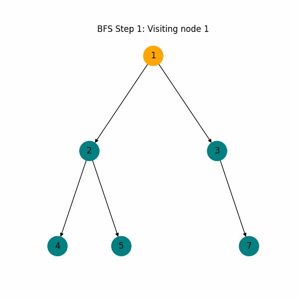

# **BFS Traversal - Trees (Data Structures and Algorithms)**
This module demonstrates the **Breadth-First Search (BFS)** traversal for binary trees, a fundamental traversal method in Data Structures and Algorithms (DSA). BFS traversal, also known as Level-Order Traversal, explores each level of the tree before moving to the next, making it ideal for tasks requiring a level-by-level approach.

---
### Traversal Type Covered
- **BFS Traversal (Level-Order)**: It visits nodes level by level from the root.

The animated GIF provides a visual representation of the BFS traversal sequence, showing the nodes visited at each level.

---
## 🛠️ Installation

To set up and run this code, clone the repository and navigate to the `bfs_traversal` directory:

```bash
git clone https://github.com/arnabsaha7/dsa.git
cd dsa/Trees/bfs_traversal
```

Install the required libraries for the visualization:

```bash
pip install matplotlib networkx
```
---
## 🚀 Usage

1. Run `bfs_traversal.py` to perform a BFS traversal on the sample binary tree and generate an animated visualization.
2. The animation will be saved as a GIF in the `img` folder.

```bash
python bfs_traversal.py
```
---
## 🎥 BFS Traversal Visualization

The animation illustrates the BFS traversal path, highlighting nodes in each level of the tree as they’re visited.

<div align="center">
  
</div>

---
## 📂 Project Structure

```plaintext
    Trees/
        └── bfs_traversal/
            ├── bfs_traversal.py       # Main code file for BFS traversal
            ├── img/
            │   └── bfs_traversal.gif  # BFS Traversal Animation
            └── README.md              # Project documentation
```

---
## 🤝 Contributions
Contributions are welcome! Feel free to submit pull requests to enhance the visualization or add other BFS variations.
