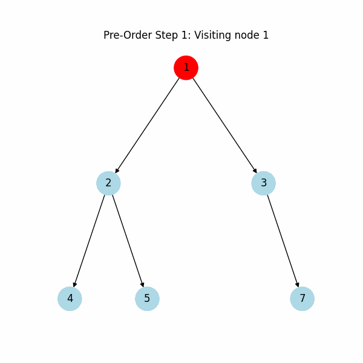
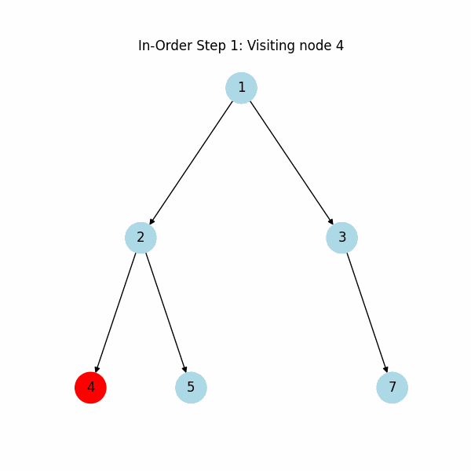

# DFS Traversal - Trees (Data Structures and Algorithms)
This module provides implementations of Depth-First Search (DFS) traversal methods for binary trees, part of essential Data Structures and Algorithms (DSA). DFS traversals are key to understanding tree structures, with each traversal type (Pre-Order, In-Order, Post-Order) suited to specific applications.

---
### Traversal Types Covered
- **Pre-Order Traversal**: Root → Left → Right
- **In-Order Traversal**: Left → Root → Right
- **Post-Order Traversal**: Left → Right → Root

Each traversal method is paired with a dynamic GIF visualization for an interactive learning experience.

---
## 🛠️ Installation

To get started, clone the repository and navigate to the correct folder:

```bash
git clone https://github.com/arnabsaha7/dsa.git
cd dsa/Trees/dfs_traversal
```

Ensure you have the necessary libraries installed for visualization:

```bash
pip install matplotlib networkx
```

---
## 🚀 Usage

1. Run the `traversal.py` file to execute each traversal and generate visual animations.
2. GIFs for each traversal (Pre-Order, In-Order, Post-Order) will be saved automatically upon running the script.

```bash
python traversal.py
```

## 🎥 Traversal Visualizations

The following animations illustrate each DFS traversal. Nodes are visited in sequence based on each traversal’s rule, highlighting the unique path each one takes through the tree.

<div align="center">
  <table>
    <tr>
      <td></td>
      <td></td>
      <td></td>
    </tr>
    <tr>
      <td align="center">Pre-Order Traversal</td>
      <td align="center">In-Order Traversal</td>
      <td align="center">Post-Order Traversal</td>
    </tr>
  </table>
</div>

---
## 📂 Project Structure

```Directory Style
dsa_repo/
└── dfs_traversal/
    └── Trees/
        ├── traversal.py                 # Main code file for DFS traversal methods
        ├── img/
        │   ├── preorder_traversal.gif   # Pre-Order Traversal Animation
        │   ├── inorder_traversal.gif    # In-Order Traversal Animation
        │   └── postorder_traversal.gif  # Post-Order Traversal Animation
        └── README.md                    # Project documentation
```

